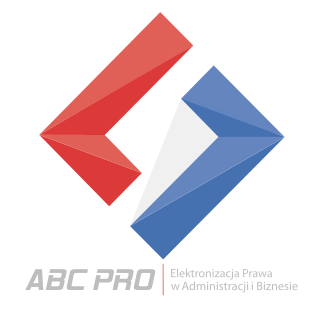

# Elektronizacja prawa
Udostępniane publicznie standardy, schematy i&nbsp;opisy oraz kod źródłowy oprogramowania przeznaczony do celów komercyjnych i&nbsp;niekomercyjnych. 

## Paczka eADM i Niezbędne Elementy Struktury 2.0

W&nbsp;podkatalogu [NES/v2.0](nes/v2.0/README.md) znajdują się biblioteki do tworzenia, edycji i&nbsp;podpisywania paczki eADM oraz plików metadanych zgodnych z&nbsp;NES 2.0.

## Generator losowych zdań po polsku

W&nbsp;podkatalogu [psg](psg/README.md) znajduje się biblioteka służąca do generowania zdań po polsku, np. w&nbsp;celu testowania zachowań edytorów tekstów.
 
## O ABC PRO  

Misją firmy ABC PRO Sp. z o.o. i&nbsp;jest tworzenie i&nbsp;dostarczanie wyspecjalizowanych aplikacji wspierających szeroko rozumianą „elektronizację prawa”. Nasze rozwiązania obejmują kluczowe zagadnienia związane z&nbsp;tworzeniem i&nbsp;publikacją prawa w Polsce, zarówno na szczeblu samorządowym jak i&nbsp;centralnym.

Firma ABC PRO Sp. z o.o. działa na polskim rynku informatycznym od 2009 r. Od 1&nbsp;maja 2011&nbsp;r. przejęła działalność firmy A&BC działającej na rynku od 2002&nbsp;r. Początkowo jako A&BC zajmowaliśmy się tworzeniem systemów Biuletynu Informacji Publicznej. Kolejnym przedmiotem naszego zainteresowania były systemy zarządzania dokumentami, elektroniczne formularze, elektroniczne skrzynki podawcze, słowem wszystko, co wiąże się z&nbsp;„e-Urzędem”. Zdobyta wiedza i&nbsp;doświadczenie pozwoliły nam następnie na zajęcie się jeszcze trudniejszą grupą zagadnień związanych z&nbsp;elektronicznym dokumentem strukturalnym i&nbsp;podpisem cyfrowym. Od 2006&nbsp;r. prowadzimy nieustanne prace nad systemami do szeroko rozumianej „elektronizacji prawa”. Nasze produkty umożliwiają edycję, publikację oraz zarządzanie zbiorami aktów prawnych w&nbsp;postaci elektronicznej. Jako jedyni dysponujemy pełną gamą produktów w&nbsp;tym zakresie.

Nasze aplikacje tworzymy w&nbsp;oparciu o&nbsp;aktualne wymogi prawne oraz wiedzę i&nbsp;doświadczenie z&nbsp;zakresu informatyki i&nbsp;administracji publicznej. Znamy i&nbsp;rozumiemy problemy i&nbsp;wyzwania, jakie stoją przed współczesną administracją publiczną oraz potrzeby i&nbsp;oczekiwania Urzędów i&nbsp;sektoru bankowego. Dzięki bogatemu doświadczeniu wyniesionemu z&nbsp;pracy w&nbsp;administracji publicznej oraz bardzo zdolnemu, ambitnemu zespołowi młodych programistów, jesteśmy w&nbsp;stanie tworzyć nowatorskie rozwiązania. Najlepszym tego przykładem są takie nasze aplikacje i&nbsp;systemy jak Edytor Aktów Prawnych Legislator, Elektroniczne Dzienniki Urzędowe oraz Baza Aktów Własnych.

 

